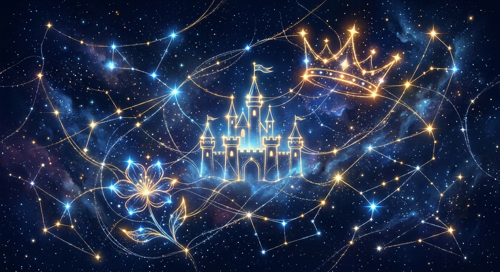

# 🌌 Tema: Teorija Disneyjevog i Pixarovog Zajedničkog Svemira

Interaktivna full-stack mrežna vizualizacija i sveobuhvatna znanstvena analiza koja istražuje fascinantne veze, uskršnja jaja (Easter eggs), filmsku statistiku i teorije obožavatelja koje spajaju Disneyjeve i Pixarove svjetove u jednu veliku, neraskidivu priču.

Aplikacija je integrirana s akademskim radom izrađenim za **Filozofski fakultet, Odsjek za Pedagogiju** u sklopu kolegija *Istraživanje društvenih mreža*.

## 🎨 O Projektu & Najnovije Promjene

Ovo istraživanje pruža jedinstvenu mrežnu vizualizaciju **preko 80 likova, ključnih artefakata i narativnih teorija**. Graf je strukturiran kako bi matematički i vizualno dokazao povezanost naizgled nepovezanih djetinjstava.

### 🌟 Novo i Implementirano:
1. **Podjela Grafa u Tri Narativna Svijeta (Grupe):**
   - **Disney Klasici (Ljubičasta regija):** Tradicionalne i moderne bajke, kraljevstva i magija (npr. *Kralj lavova*, *Mala Sirena*, *Snježno kraljevstvo*).
   - **Pixar Svemir (Narančasta regija):** Svjetovi igračaka, tehnologije, automobila i emocija (npr. *Toy Story*, *Wall-E*, *Monsters Inc.*).
   - **Igrani Svemir / Film (Plava regija):** Live-action adaptacije, stvarni likovi i povijest (npr. *Pirati s Kariba*, *Cruella*, *Mary Poppins*).
   - *Sve tri skupine su fizički razdvojene u vlastite privlačne centre (regionalne klastere), ali ostaju mrežnopovezane, što posjetiteljima daje trenutačni uvid u strukturu meta-svemira uz velike, blage pozadinske natpise u grafu.*

2. **Vodič za Gledanje (Watchlist) u Vizualnom Rječniku:**
   - Dodan je skrolajući, responzivno dizajniran vodič za gledanje s popisom svih uključenih crtića i filmova po skupinama. Idealno za sve koji se žele upustiti u gledanje kronološkim ili tematskim slijedom.

3. **Filmska Statistika i Dvojni Komparator (Crtić vs. Igrani Film):**
   - Implementiran je inteligentni sustav usporedbe. Kada kliknete na lik koji ima animirani original i igrani remake (npr. Belle, Mulan, Jasmine), aplikacija će automatski povući podatke za oba čvora, izračunati razliku u IMDb ocjenama (npr. "+2.1 original") i ponuditi gumb za trenutačno premještanje fokusa na dvojnika na grafu.

4. **Animirani Benchmark (Interaktivna Tablica Klasika):**
   - Integrirana je vizualna rang-lista top 10 animiranih ostvarenja s prikazom detaljnih metrika: budžeti, box-office zarada, broj mrežnih veza i ocjene publike. Pobjednik s najvišom ocjenom (**Kralj lavova** s ocjenom 8.5) dinamički je istaknut ekskluzivnim zlatnim rubom i oznakom `LEADER`.

5. **Akademska Integracija:**
   - Cijeli sustav je prilagođen radu Yelyzavete Kupriienko za **Odsjek za Pedagogiju** na Filozofskom fakultetu, naglašavajući ulogu zajedničkih narativa u dječjem razvoju i razumijevanju složenih medijskih struktura.

---

## 🛠️ Tehnologije
- **React 18/19** & **TypeScript**
- **D3.js** za simulaciju sila u grafu (force-directed graph), zumiranje, povlačenje i centroidno pozicioniranje
- **Tailwind CSS** za elegantan, mračan futuristički dizajn
- **Framer Motion / Motion** za glatke prijelaze čvorova i panela
- **Lucide React** za ikone akademije i dizajna

---

## 📖 Tri Glavna Svijeta u Grafu

- **🟣 Disney Klasici:** Fokusirani na sjeverna kraljevstva (Arendelle, Corona), oceansku magiju (Tritonovo carstvo) i drevne legende.
- **🟠 Pixar Svemir:** Baziran na Pixarovoj vremenskoj liniji koja se kreće od prapovijesti (Merida) preko modernog ljudskog doba (Toy Story) pa sve do daleke budućnosti i kolonizacije svemira (Wall-E).
- **🔵 Igrani Svemir (Live-Action):** Premošćuje jaz između animacije i stvarnosti kroz povijesne ličnosti i moderne igrane blockbuster uspješnice.

---

*Izgrađeno s ljubavlju prema Disney/Pixar magiji, mrežnim znanostima i moći zajedničkog pripovijedanja u pedagogiji.*
