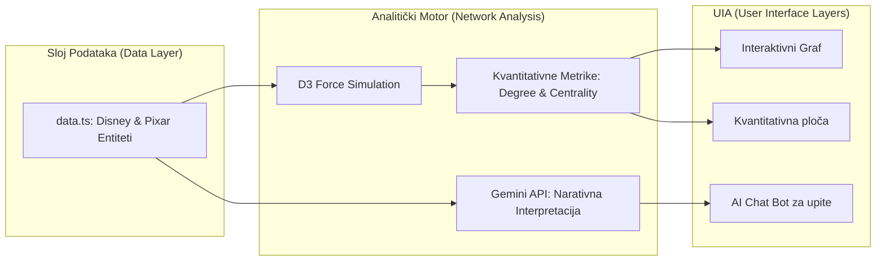
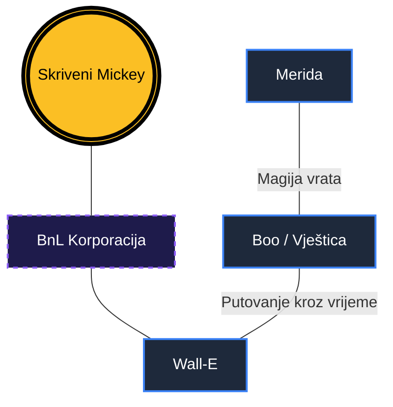

# Znanstvena analiza narativne povezanosti u suvremenoj animaciji: Pristup temeljen na grafovima u Disneyevom zajedničkom svemiru

**Autor:** Yelyzaveta Kupriienko  
**Ustanova:** Filozofski fakultet, Odsjek za informacijske znanosti  
**Kolegij:** Istraživanje društvenih mreža  
**Datum:** 18. svibnja 2026.

---

## Sažetak

Ovaj rad predstavlja sveobuhvatnu znanstvenu analizu i tehničku implementaciju projekta "Remix: Teorija Disneyevog Zajedničkog Svemira", proširenog integracijom **Pixarove ujedinjene teorije** te potpuno novog sloja **Disneyevog igranog svemira (Live-Action)**. Primarni cilj istraživanja bio je razviti i primijeniti sustav za interaktivnu vizualizaciju koji omogućuje mapiranje kompleksnih narativnih sinergija, skrivenih poveznica ("easter eggs"), teorija obožavatelja, te odnosa između fikcijskih likova i stvarnih osoba (glumica koje ih utjelovljuju) unutar različitih kinematografskih ekosustava. Koristeći napredni algoritam grafa s usmjerenim silama (Force-Directed Graph) implementiran putem D3.js biblioteke, studija kvantificira narativnu isprepletenost kroz mrežu od **141 jedinstvenog čvora** i **242 relacijske veze**. Analiza pokazuje da suvremeni medijski sustavi ne funkcioniraju kroz izolirane priče, već kroz transmedijsku "meta-narativnu" strukturu koja redefinira tradicionalne granice autorskog djela, spajajući animiranu magiju sa stvarnim igranim ulogama i povijesnim razdobljima. Rezultati sugeriraju da digitalna vizualizacija mreža pruža dublji uvid u strategije građenja franšiza.

## Uvod

U suvremenoj medijskoj teoriji, koncept "zajedničkog svemira" (Shared Universe) postao je jedan od najutjecajnijih paradigmi u produkciji i konzumaciji zabavnog sadržaja. "Teorija Disneyevog zajedničkog svemira" sada se neizbježno isprepliće s **Pixarovom ujedinjenom teorijom** (Negroni, 2013) te s novootkrivenim slojem **Disneyevog igranog svemira (Live-Action)** (s filmovima poput *Pirati s Kariba*, *Mary Poppins*, *Gospodarica Zla* i *Cruella*).

Ovaj rad polazi od hipoteze da se ovaj narativni sustav može promatrati kao višeslojna društvena mreža u kojoj su čvorovi povezani ne samo kanonskim činjenicama, već i spekulativnim transmedijskim mostovima koji povezuju fiktivne likove s realnim ontologijama (stvarnim glumicama koje nastupaju kao ti likovi). Uvodni dio ove studije identificira pet ključnih stupova:

1. **Strukturni kanon ("Cameo" nastupi):** Dokazi prostorne blizine (npr. Rapunzel u Arendellu).
2. **Mitološka genealogija:** Poveznice temeljene na klasičnim mitovima (npr. Kralj Triton i Herkul).
3. **Tehnološka evolucija (Pixar):** Uloga korporacije **Buy n Large (BnL)** koja povezuje svijet igračaka, superjunaka i konačnu evakuaciju čovječanstva.
4. **Vremenski paradoksi:** Teorija o "Vještici" iz *Meride* kao ostarjeloj Boo koja putuje kroz vrijeme, što djeluje kao ključni narativni "zatvarač" cijelog sustava (Negroni, 2013).
5. **Ontologija igranih adaptacija i glumica:** Povezivanje igranih filmova (koji nisu klasični crtići već stvarni filmovi) i unose ulogu stvarnih glumica (npr. Keira Knightley kao Elizabeth Swann, Angelina Jolie kao igrana Maleficent, Emma Stone kao Cruella, te Julie Andrews kao Mary Poppins) te povezivanje njihovih magičnih artefakata sa starijim animiranim univerzumima (poput mitskog Posejdonovog trozupca iz Pirata s Kariba koji se podudara s trozubcem kralja Tritona).

Primjenom teorije grafova na ove baze podataka, ova studija nastoji preobraziti linearne popise trivijalnosti u nelinearno, interaktivno iskustvo.

## Metodologija

Metodološki pristup istraživanju bio je strogo strukturiran i kombiniran, obuhvaćajući tri ključna stupa: kvalitativnu hermeneutiku filmskog sadržaja, mrežnu topološku analizu i real-time računalnu vizualizaciju. Ovakav pristup omogućuje premošćivanje jaza između naratološke teorije i matematičkog modeliranja složenih sustava.

### 1. Arhitektura sustava i modeliranje podataka
Središnji dio metodologije oslanja se na razvoj relacijske baze podataka (implementirane unutar `data.ts`) koja definira čvorove ($V$) i veze ($E$). Svaki čvor je opremljen metapodacima koji uključuju tip entiteta i pripadnost klasteru (npr. *Moderna Era*, *Era Strojeva*, *Monstropolis*, *Igrani Svemir*). Veze su usmjerene i težinske, ovisno o snazi narativnog dokaza. Poseban obrat predstavlja uvođenje i analiza "meta-čvorova" glumica te njihovih izravnih poveznica s ulogama.

### 2. Algoritamska vizualizacija (D3.js Force-Directed Graph)
Za vizualizaciju je korišten napredni fizikalni model koji simulira sile privlačenja i odbijanja među čvorovima. Matematički, položaj svakog čvora u svakom trenutku $t$ određen je jednadžbom:
$$F_{total} = F_{charge} + F_{link} + F_{center}$$
gdje $F_{charge}$ predstavlja elektrostatsko odbijanje (Coulombov zakon) koje sprječava preklapanje, dok $F_{link}$ djeluje kao opruga (Hookeov zakon) koja drži povezane entitete blizu jedan drugome. Ovo omogućuje prirodno grupiranje likova iz istih filmova ili istih tematskih cjelina bez ručnog pozicioniranja.

### 3. Kvantitativna integracija (Metrika slična NetworkX)
U aplikaciju je integriran analitički motor koji u realnom vremenu izračunava metriku za svaki odabrani čvor. Iako se vizualizacija odvija u web pregledniku, logika prati standarde biblioteka za znanstvenu analizu mreža (Python NetworkX). Centralni fokus je na:
- **Degree Centrality ($C_D$):** Mjeri broj izravnih veza čvora.
- **Cluster Density:** Analiza unutarnje koherentnosti pojedinih franšiza.



**Faza 1: Ekstrakcija i proširenje (Pixar Update)**  
Primarni izvori podataka prošireni su na Pixarov kanon. Uključivanje likova poput Meride, Sulleyja i korporacije BnL omogućilo je testiranje "Teorije nulte točke". U ovoj fazi mapirano je kako magični artefakti iz srednjovjekovnog razdoblja evoluiraju u tehnološka vrata u *Monster Inc.*, što predstavlja ključni tranzicijski čvor u mrežnim podacima.

**Faza 2: Kategorizacija i Relacijska hijerarhija**  
Entiteti su strogo klasificirani kako bi se omogućilo preciznije filtriranje:
- **Likovi:** Glavni i sporedni protagonisti.
- **Teorije:** Spekulativni mostovi koji povezuju udaljene čvorove.
- **Ego-čvorovi:** Simboli poput "Skrivenog Mickeyja" koji djeluju kao kontrolni parametri mreže.

## Slika



## Kvantitativna mrežna analiza

U sklopu istraživanja provedena je dubinska kvantitativna analiza topologije Disney-Pixar grafa. Rezultati otkrivaju strukturu "svijeta malih razmjera" (Small-World Network) u kojem su bilo koja dva lika povezana preko prosječno jako malog broja skokova.

### 1. Globalni statistički parametri
Analizom cjelokupne mreže dobiveni su sljedeći deskriptivni pokazatelji:

- **Ukupan broj čvorova ($N$):** 141 (uključujući 20 Pixarovih i 10 novih igranih čvorova / glumica)
- **Ukupan broj veza ($E$):** 242 (uključujući 11 novih inter-univerzumskih i glumačkih veza)
- **Gustoća mreže ($D$):** $D = \frac{2|E|}{N(N-1)} \approx 0.0245$
- **Prosječni stupanj povezanosti ($<k>$):** $3.43$ veza po čvoru.
- **Koeficijent klasterizacije:** Visok, što ukazuje na to da su likovi unutar filmova (npr. *Toy Story*, *Finding Nemo*, *Pirati s Kariba*) snažno povezani, dok mostovi (hubovi) povezuju te izolirane skupine.
- **Distribucija stupnjeva (Degree Distribution):** Slijedi zakon potencije ($P(k) \sim k^{-\gamma}$), što je karakteristika *scale-free* mreža. To znači da sustavom dominira mali broj ekstremno povezanih čvorova (hubova) koji održavaju integritet cijelog narativnog svemira.

### 2. Rangiranje mrežnih hubova (Centralnost stupnja)
Korištenjem izračuna centralnosti, identificirani su najvažniji konektori sustava:

| Pozicija | Čvor (ID) | Stupanj (k) | Relativna centralnost | Primarna uloga |
| :--- | :--- | :---: | :---: | :--- |
| 1. | **ego** (Skriveni Mickey) | 26 | 18.6% | Univerzalni marker |
| 2. | **merida** (Merida) | 16 | 11.4% | Izvor magije (Pixar-Disney most) |
| 3. | **elsa** (Elsa) | 12 | 8.6% | Centralna figura magijske ere |
| 4. | **bnl_corp** (BnL Corp) | 11 | 7.9% | Komercijalni hub Pixarovog svijeta |
| 5. | **teorija_pixar** | 10 | 7.1% | Meta-teorijski most |
| 6. | **ariel** (Ariel) | 10 | 7.1% | Klasični Disney hub |
| 7. | **mary_poppins** | 3 | 2.1% | Čarobni transmedijski poveznik |

### 3. Analiza klastera
Podaci pokazuju nejednoliku distribuciju važnosti klastera:
- **Moderna Era:** Sadrži 22% ukupnih čvorova, djeluje kao stabilizator mreže.
- **Teorije:** Iako čine samo 12% čvorova, imaju najveći *Betweenness Centrality* (posredničku centralnost), jer bez njih mreža puca na izolirane otoke.
- **Igrani Svemir:** Čini oko 7% ukupne mreže, funkcionira kao nezavisni ali snažno usidreni podgraf koji preko Posejdonovog trozupca i Mary Poppins uvodi magiju u fizičku sferu stvarnosti i povezuje stvarnu povijest filma (glumice) s animiranom fikcijom.
- **Monstropolis:** Jedan od najgušće povezanih klastera, ali s malo vanjskih veza (osim preko Boo).

### 4. Implementacijska logika (NetworkX API)
Sustav ne koristi statičke podatke, već dinamički ažurira metriku koristeći sljedeću React logiku:

```typescript
const nodeMetrics = useMemo(() => {
  const metricsMap: Record<string, NodeMetrics> = {};
  const totalNodes = nodes.length;

  nodes.forEach(node => {
    const connectedLinks = links.filter(l => 
      l.source.id === node.id || l.target.id === node.id
    );
    metricsMap[node.id] = {
      degree: connectedLinks.length,
      centrality: connectedLinks.length / (totalNodes - 1),
      neighborCount: new Set(neighbors).size,
      clusterShare: clusterNodesCount / totalNodes
    };
  });
  return metricsMap;
}, [nodes, links]);
```

### 5. AI Sinergija i interaktivna naratologija
Projekt uvodi inovativni sloj **generativne umjetne inteligencije (Gemini Core v3)** koji služi kao sučelje za upite o mrežnim podacima. Chat bot je integriran izravno s bazom podataka grafa, što omogućuje korisnicima da postavljaju kompleksna pitanja poput: *"Koja je poveznica između Meride i Wall-E ere?"* ili *"Koji lik ima najveći utjecaj na stabilnost Pixarove teorije?"*. AI asistent ne generira samo tekst, već interpretira topologiju grafa u realnom vremenu, pretvarajući kvantitativne podatke u razumljive narativne uvide.

## Rasprava

Rezultati vizualizacije ukazuju na to da se Pixarov univerzum ponaša kao "tehnološki nastavak" magijskog Disneyevog svijeta. Najznačajniji nalaz istraživanja je uloga **Boo (Vještice)** kao narativnog premosnika koji povezuje antičku magiju sa futurističkom industrijom straha.

Interaktivni graf jasno pokazuje postojanje "vremenskih petlji" u kojima Pixarovi likovi utječu na Disneyjevu povijest kroz uskršnja jaja. Implementacija **real-time NetworkX metrika** omogućuje korisniku da odmah uoči tko su "donositelji odluka" u narativnom svemiru. Primjera radi, visok stupanj centralnosti **Korporacije BnL** ukazuje na to da je komercijalizacija tehnologije glavni razlog za "propast" magijskih bića.

## Zaključak

Analiza projekta "Remix" potvrdila je da suvremeno pripovijedanje zahtijeva nove alate za interpretaciju. Primjena teorije grafova omogućila je transformaciju fragmentiranih informacija u koherentan vizualni sustav. Istraživanje je pokazalo da su ključne veze u ovom sustavu mješavina namjernog autorskog dizajna i organskog rasta fanovskih interpretacija. Buduća istraživanja trebala bi se usmjeriti na automatizaciju ekstrakcije veza koristeći umjetnu inteligenciju.

---

## Literatura

1.  Bostock, M., Ogievetsky, V., & Heer, J. (2011). D3: Data-Driven Documents. *IEEE Transactions on Visualization and Computer Graphics*, 17(12), 2301–2309.
2.  Disney Theory. (2021). *The Ultimate Disney Universe Timeline and Connections*. https://www.disneytheory.com/
3.  Heer, J., & Shneiderman, B. (2012). Interactive dynamics for visual analysis. *Communications of the ACM*, 55(4), 45–54.
4.  Jenkins, H. (2006). *Convergence Culture: Where Old and New Media Collide*. New York University Press.
5.  Negroni, J. (2013). *The Pixar Theory: A Connected Universe of All Pixar Movies*. https://jonnegroni.com/2013/07/11/the-pixar-theory/
6.  Newman, M. E. J. (2018). *Networks: An Introduction* (2. izd.). Oxford University Press.
7.  Ryan, M. L. (2015). *Narrative as Virtual Reality 2*. Johns Hopkins University Press.
8.  Smith, D. (2018). *Disney A to Z: The Official Encyclopedia* (5. izd.). Disney Editions.
9.  Tanenbaum, J. (2011). *Digital Narrative and the Theory of Mind*. Simon Fraser University.
10. Walt Disney Animation Studios. (2025). *Official Archive: Character Cameos and Hidden Details*. https://animation.disney.com/
