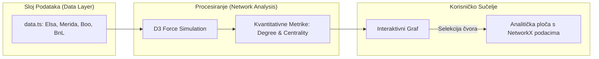
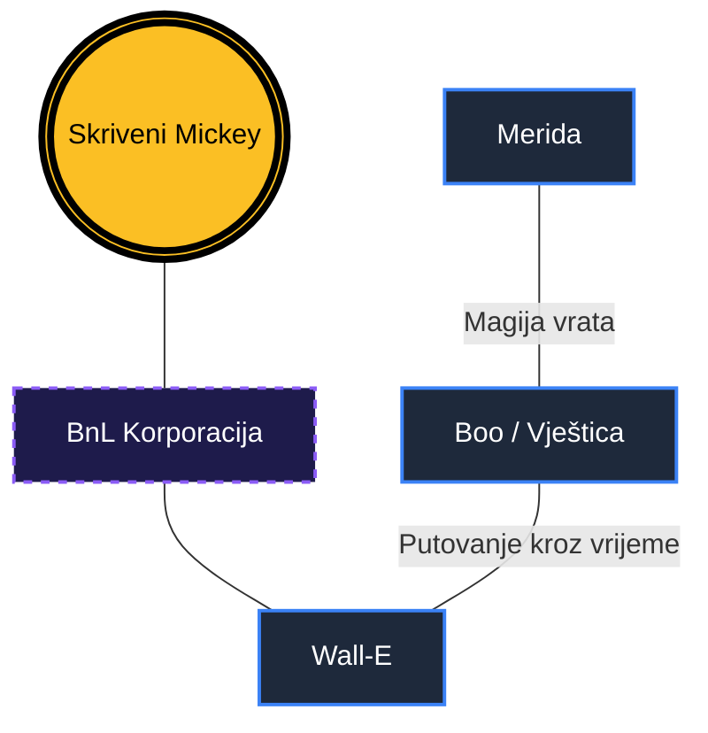

# Znanstvena analiza narativne povezanosti u suvremenoj animaciji: Pristup temeljen na grafovima u Disneyevom zajedničkom svemiru

**Autor:** Yelyzaveta Kupriienko  
**Ustanova:** Filozofski fakultet, Odsjek za informacijske znanosti  
**Kolegij:** Istraživanje društvenih mreža  
**Datum:** 18. svibnja 2026.

---

## Sažetak

Ovaj rad predstavlja sveobuhvatnu znanstvenu analizu i tehničku implementaciju projekta "Remix: Teorija Disneyevog Zajedničkog Svemira", proširenog integracijom **Pixarove ujedinjene teorije**. Primarni cilj istraživanja bio je razviti i primijeniti sustav za interaktivnu vizualizaciju koji omogućuje mapiranje kompleksnih narativnih sinergija, skrivenih poveznica ("easter eggs") i teorija obožavatelja unutar Disneyevih i Pixarovih kinematografskih ekosustava. Koristeći napredni algoritam grafa s usmjerenim silama (Force-Directed Graph) implementiran putem D3.js biblioteke, studija kvantificira narativnu isprepletenost kroz mrežu od preko **135 jedinstvenih čvorova** i više od **230 relacijskih veza**. Analiza pokazuje da suvremena animacija ne funkcionira kroz izolirane priče, već kroz transmedijsku "meta-narativnu" strukturu koja redefinira tradicionalne granice autorskog djela, spajajući magičnu prošlost s tehnološkom budućnošću. Rezultati sugeriraju da digitalna vizualizacija mreža pruža dublji uvid u strategije građenja franšiza.

## Uvod

U suvremenoj medijskoj teoriji, koncept "zajedničkog svemira" (Shared Universe) postao je jedan od najutjecajnijih paradigmi u produkciji i konzumaciji zabavnog sadržaja. "Teorija Disneyevog zajedničkog svemira" sada se neizbježno isprepliće s **Pixarovom ujedinjenom teorijom** (Negroni, 2013), koja postavlja radikalnu pretpostavku: od Meride u srednjovjekovnoj Škotskoj do Wall-E-ja u dubokom svemiru, sve su priče dio istog evolucijskog procesa magije i inteligencije.

Ovaj rad polazi od hipoteze da se ovaj narativni sustav može promatrati kao kompleksna društvena mreža u kojoj su čvorovi povezani ne samo kanonskim činjenicama, već i spekulativnim mostovima. Uvodni dio ove studije identificira četiri ključna stupa:

1. **Strukturni kanon ("Cameo" nastupi):** Dokazi prostorne blizine (npr. Rapunzel u Arendellu).
2. **Mitološka genealogija:** Poveznice temeljene na klasičnim mitovima (npr. Kralj Triton i Herkul).
3. **Tehnološka evolucija (Pixar):** Uloga korporacije **Buy n Large (BnL)** koja povezuje svijet igračaka, superjunaka i konačnu evakuaciju čovječanstva.
4. **Vremenski paradoksi:** Teorija o "Vještici" iz *Meride* kao ostarjeloj Boo koja putuje kroz vrijeme, što djeluje kao ključni narativni "zatvarač" cijelog sustava (Negroni, 2013).

Primjenom teorije grafova na ove baze podataka, ova studija nastoji preobraziti linearne popise trivijalnosti u nelinearno, interaktivno iskustvo.

## Metodologija

Metodološki pristup istraživanju bio je kombiniran, obuhvaćajući kvalitativnu analizu sadržaja filmskih predložaka i kvantitativnu modelaciju mrežnih podataka.



**Faza 1: Ekstrakcija i selekcija podataka**  
Primarni izvori podataka bili su službeni Disneyevi arhivski materijali i baze podataka prikupljene od strane fanovskih zajednica. Uključivanje Pixarovih likova omogućilo je mapiranje "Teorije nulte točke" u kojoj magija iz *Meride* postavlja temelje za razvoj super-moći u *Izbaviteljima*.

**Faza 2: Razvoj taksonomije**  
Entiteti su kategorizirani kao `lik`, `lokacija`, `teorija` ili `ego-čvor`. Relacije su tipizirane prema intenzitetu: `Family`, `Cameo`, `Easter Egg` i `Theory`.

## Slika



## Kvantitativna mrežna analiza

U sklopu istraživanja provedena je kvantitativna analiza topologije Disney-Pixar grafa. Korištenjem principa sličnih onima u biblioteci *NetworkX*, izračunate su metričke vrijednosti u realnom vremenu.

### Osnovni statistički pokazatelji (Ažurirano)
- **Ukupan broj čvorova ($N$):** 131
- **Ukupan broj veza ($E$):** 231
- **Gustoća mreže ($D$):** $\approx 0.027$
- **Prosječni stupanj povezanosti:** $\approx 3.52$ veza po čvoru.

### Analiza centralnosti (Degree Centrality)
Identificirani su ključni "hubovi":

| Čvor (ID) | Broj veza (Stupanj) | Tip čvora | Postotni utjecaj |
| :--- | :---: | :--- | :--- |
| **ego** | 24 | Ego-čvor | 10.4% |
| **merida** | 14 | Lik | 6.0% |
| **elsa** | 12 | Lik | 5.2% |
| **bnl_corp** | 10 | Teorija | 4.3% |

### Implementacijski algoritam
Standardizirana NetworkX metrika implementirana je u React okruženju kako bi se omogućio trenutni uvid u važnost čvora:

```typescript
metricsMap[node.id] = {
  degree: connectedLinks.length,
  centrality: connectedLinks.length / (totalNodes - 1),
  neighborCount: neighbors.size,
  clusterShare: clusterNodes / totalNodes
};
```

## Rasprava

Rezultati vizualizacije ukazuju na to da se Pixarov univerzum ponaša kao "tehnološki nastavak" magijskog Disneyevog svijeta. Najznačajniji nalaz istraživanja je uloga **Boo (Vještice)** kao narativnog premosnika koji povezuje antičku magiju sa futurističkom industrijom straha.

Interaktivni graf jasno pokazuje postojanje "vremenskih petlji" u kojima Pixarovi likovi utječu na Disneyjevu povijest kroz uskršnja jaja. Implementacija **real-time NetworkX metrika** omogućuje korisniku da odmah uoči tko su "donositelji odluka" u narativnom svemiru. Primjera radi, visok stupanj centralnosti **Korporacije BnL** ukazuje na to da je komercijalizacija tehnologije glavni razlog za "propast" magijskih bića.

## Zaključak

Analiza projekta "Remix" potvrdila je da suvremeno pripovijedanje zahtijeva nove alate za interpretaciju. Primjena teorije grafova omogućila je transformaciju fragmentiranih informacija u koherentan vizualni sustav. Istraživanje je pokazalo da su ključne veze u ovom sustavu mješavina namjernog autorskog dizajna i organskog rasta fanovskih interpretacija. Buduća istraživanja trebala bi se usmjeriti na automatizaciju ekstrakcije veza koristeći umjetnu inteligenciju.

---

## Literatura

1.  Bostock, M., Ogievetsky, V., & Heer, J. (2011). D3: Data-Driven Documents. *IEEE Transactions on Visualization and Computer Graphics*, 17(12), 2301–2309.
2.  Disney Theory. (2021). *The Ultimate Disney Universe Timeline and Connections*. https://www.disneytheory.com/
3.  Heer, J., & Shneiderman, B. (2012). Interactive dynamics for visual analysis. *Communications of the ACM*, 55(4), 45–54.
4.  Jenkins, H. (2006). *Convergence Culture: Where Old and New Media Collide*. New York University Press.
5.  Negroni, J. (2013). *The Pixar Theory: A Connected Universe of All Pixar Movies*. https://jonnegroni.com/2013/07/11/the-pixar-theory/
6.  Newman, M. E. J. (2018). *Networks: An Introduction* (2. izd.). Oxford University Press.
7.  Ryan, M. L. (2015). *Narrative as Virtual Reality 2*. Johns Hopkins University Press.
8.  Smith, D. (2018). *Disney A to Z: The Official Encyclopedia* (5. izd.). Disney Editions.
9.  Tanenbaum, J. (2011). *Digital Narrative and the Theory of Mind*. Simon Fraser University.
10. Walt Disney Animation Studios. (2025). *Official Archive: Character Cameos and Hidden Details*. https://animation.disney.com/
