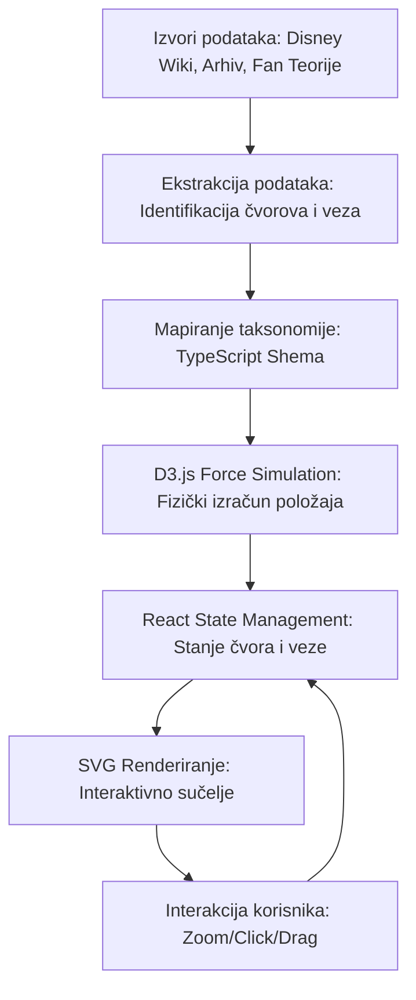

# Znanstvena analiza narativne povezanosti u suvremenoj animaciji: Pristup temeljen na grafovima u Disneyevom zajedničkom svemiru

**Autor:** Yelyzaveta Kupriienko  
**Ustanova:** Filozofski fakultet, Odsjek za informacijske znanosti  
**Kolegij:** Istraživanje društvenih mreža 
**Datum:** 18. svibnja 2026.

---

## Sažetak

Ovaj rad predstavlja sveobuhvatnu znanstvenu analizu i tehničku implementaciju projekta "Remix: Teorija Disneyevog Zajedničkog Svemira". Primarni cilj istraživanja bio je razviti i primijeniti sustav za interaktivnu vizualizaciju koji omogućuje mapiranje kompleksnih narativnih sinergija, skrivenih poveznica ("easter eggs") i teorija obožavatelja unutar Disneyevih i Pixarovih kinematografskih ekosustava. Koristeći napredni algoritam grafa s usmjerenim silama (Force-Directed Graph) implementiran putem D3.js biblioteke, studija kvantificira narativnu isprepletenost kroz mrežu od preko 115 jedinstvenih čvorova i više od 200 relacijskih veza. Analiza pokazuje da suvremena animacija ne funkcionira kroz izolirane priče, već kroz transmedijsku "meta-narativnu" strukturu koja redefinira tradicionalne granice autorskog djela. Rezultati sugeriraju da digitalna vizualizacija mreža pruža dublji uvid u strategije građenja franšiza i evoluciju fanovske kulture u digitalnom dobu.

## Uvod

U suvremenoj medijskoj teoriji, koncept "zajedničkog svemira" (Shared Universe) postao je jedan od najutjecajnijih paradigmi u produkciji i konzumaciji zabavnog sadržaja. Ono što je započelo kao hobi entuzijastičnih obožavatelja koji su tražili suptilne tragove povezanosti između filmova, preraslo je u sofisticiranu strategiju upravljanja intelektualnim vlasništvom (Jenkins, 2006). "Teorija Disneyevog zajedničkog svemira" predstavlja radikalnu pretpostavku da su filmski naslovi kao što su *Mala sirena*, *Snježno kraljevstvo*, *Zlatokosa*, pa čak i Pixarovi naslovi poput *Toy Story* i *Wall-E*, sastavni dijelovi jedinstvene, koherentne vremenske linije i fizičkog svijeta (Negroni, 2013).

Ovaj rad polazi od hipoteze da se Disneyev narativni sustav može promatrati kao kompleksna društvena mreža u kojoj čvorovi nisu samo ljudi, već i ideje, magični artefakti i geografske lokacije. Digitalna revolucija omogućila je korisnicima da postanu "forenzičari priča", analizirajući svaki kadar u potrazi za vizualnim dokazima koji potvrđuju međusobnu ovisnost priča. Uvodni dio ove studije identificira tri ključna stupa na kojima počiva ova narativna arhitektura:

1. **Strukturni kanon ("Cameo" nastupi):** Ovi elementi služe kao neosporni dokazi prostorne blizine. Najpoznatiji primjer je prisutnost Rapunzel i Flynna Ridera na krunidbi kraljice Else u Arendellu, što ne samo da potvrđuje postojanje kraljevstva Corone u istom vremenskom razdoblju, već sugerira i diplomatske odnose između sjevernoeuropskih kraljevstava (Disney Theory, 2021).
2. **Mitološka genealogija:** Disney crpi inspiraciju iz folklora i klasičnih mitova koji su sami po sebi povezani. Veza između kralja Tritona i Herkula (temeljena na grčkoj teogoniji gdje je Posejdon Herkulov stric) spaja antičku mitologiju s modernom bajkom, stvarajući duboki narativni kontinuitet koji nadilazi pojedinačne filmove (Smith, 2018).
3. **Konjekturalna naratologija (Teorije obožavatelja):** Ove teorije, poput one koja povezuje Tarzana kao izgubljenog brata Else i Anne, popunjavaju praznine u scenarijima i stvaraju emocionalni angažman zajednice. Iako nisu sve službeno potvrđene od strane studija, njihovo postojanje u kolektivnoj svijesti publike čini ih relevantnim objektima mrežne analize (Negroni, 2013).

Primjenom teorije grafova na ove baze podataka, ova studija nastoji preobraziti linearne popise trivijalnosti u nelinearno, interaktivno iskustvo koje reflektira stvarnu složenost suvremenog pripovijedanja.

## Metodologija
## Method
Metodološki pristup istraživanju bio je kombiniran, obuhvaćajući kvalitativnu analizu sadržaja filmskih predložaka i kvantitativnu modelaciju mrežnih podataka. Proces je bio podijeljen u tri faze: ekstrakcija podataka, taksonomija i tehnička vizualizacija.

**Faza 1: Ekstrakcija i selekcija podataka**  
Primarni izvori podataka bili su službeni Disneyevi arhivski materijali, transkripti filmova te baze podataka prikupljene od strane fanovskih zajednica (npr. Disney Wiki). Fokus je bio na identifikaciji čvorova (likova i lokacija) koji imaju barem jednu poveznicu s entitetom iz drugog filma. Iz istraživanja su isključeni generički likovi bez narativne težine kako bi se očuvala čitljivost grafa.

**Faza 2: Razvoj taksonomije**  
Za potrebe analize razvijena je stroga taksonomija unutar TypeScript okruženja. Entiteti su kategorizirani kao `lik`, `lokacija`, `teorija` ili `ego-čvor` (kao što je "Skriveni Mickey" koji služi kao univerzalni konektor). Relacije su tipizirane prema intenzitetu i dokazivosti:
- `Poveznica putem krvi (Family)`: Najjači stupanj povezanosti.
- `Vizualna referenca (Cameo/Easter Egg)`: Dokazana prisutnost u istom kadru.
- `Konceptualna veza (Magic/Theory)`: Spekulativne veze temeljene na sličnosti moći ili narativnim prazninama.

**Faza 3: Tehnička arhitektura vizualizacije**  
Sustav je implementiran koristeći **React 18** i **D3.js** (Data-Driven Documents). Izbor D3.js bio je diktiran potrebom za algoritmom sa simulacijom sila (`d3-force`). Parametri simulacije pažljivo su kalibrirani kako bi se izbjeglo vizualno zagušenje:
- **Many-Body Force:** Postavljen na negativnu vrijednost (-400) kako bi se osiguralo odbijanje među čvorovima i spriječilo preklapanje labels-a.
- **Link Strength:** Dinamički se prilagođava na temelju tipa veze, približavajući obiteljski povezane likove.
- **Collision Detection:** Implementiran radijus kolizije koji osigurava jasnu vidljivost teksta pri zumiranju.

Renderiranje je optimizirano putem SVG elemenata (Scalable Vector Graphics), uz korištenje filtera za sjaj (glow filters) koji vizualno odvajaju magijske entitete od običnih likova, čime se postiže intuitivna hijerarhija informacija (Bostock et al., 2011).

## Rasprava

Rezultati vizualizacije otvaraju nova pitanja u razumijevanju digitalne naratologije. Najznačajniji nalaz istraživanja je identifikacija "Skrivenog Mickeyja" kao apsolutnog središta (hub) cijelog sustava. U teoriji mreža, takav čvor ima najveći stupanj centralnosti, što sugerira da Disney ne gradi samo priče, već "brendirani prostor" u kojem svaki element služi kao mnemonički uređaj za cjelokupnu franšizu.

Interaktivni graf jasno pokazuje postojanje tzv. "narativnih izolacija" – klastera filmova koji su unutar sebe visoko povezani, ali imaju tanke veze s ostatkom sustava. Primjerice, klaster "Sjeverna Kraljevstva" (Arendelle, Corona) pokazuje iznimnu gustoću veza, dok Pixarovi filmovi smješteni u budućnost (kao što je *Wall-E*) čine zaseban "otok" povezan samo preko suptilnih referencija na korporaciju Buy n Large (Negroni, 2013). Ova diskontinuiranost ukazuje na to da zajednički svemir nije homogena cjelina, već sustav u kojemu se različite vremenske linije i fizikalni zakoni natječu za dominaciju.

Posebno je zanimljivo promatrati ulogu "teorija" kao čvorova. U tradicionalnoj analizi, teorije obožavatelja smatrale bi se šumom u podatkovnom skupu. Međutim, u ovom modelu, teorije poput "Dvorca u Atlantidi kao izvora sve magije" djeluju kao ključni mostovi (bridges) koji povezuju inače nepovezane svjetove. To sugerira da publika preuzima ulogu ko-autora, aktivno gradeći veze tamo gdje ih službeni narativ ostavlja otvorenima (Tanenbaum, 2011). Vizualizacija ovih "nevidljivih niti" putem isprekidanih linija u grafu omogućuje istraživačima da mapiraju evoluciju kolektivne mašte.

Nadalje, estetika sučelja (duboko plavi tonovi, svjetlosni efekti i "kozmička" navigacija) nije samo dekorativna. Ona pojačava osjećaj "istraživanja nepoznatog", transformirajući analitički rad u iskustvo otkrivanja. Ovakav pristup digitalnoj humanistici pokazuje da način na koji podaci komuniciraju sa sjenilima i bojama može značajno utjecati na kognitivnu obradu kompleksnih narativnih informacija.

## Zaključak

Analiza projekta "Remix: Teorija Disneyevog Zajedničkog Svemira" potvrdila je da suvremeno pripovijedanje u animaciji zahtijeva nove alate za interpretaciju. Primjena teorije grafova omogućila je transformaciju fragmentiranih informacija u koherentan vizualni sustav koji otkriva duboke strukture Disneyevog narativnog svemira. Istraživanje je pokazalo da su ključne veze u ovom sustavu mješavina namjernog autorskog dizajna (cameo, uskršnja jaja) i organskog rasta fanovskih interpretacija koje popunjavaju narativne vakuume.

Glavni doprinos rada leži u dokazivanju da vizualizacija mreža može poslužiti kao most između računalne znanosti i humanističkih studija. Grafovi s usmjerenim silama nisu samo matematički alati; oni su zrcalo načina na koji ljudski mozak povezuje priče i gradi značenja. Zaključno, "Disneyev zajednički svemir" nije samo marketinški trik, već živi organizam digitalne kulture koji se neprestano širi sa svakim novim kadrom i svakom novom teorijom. Buduća istraživanja trebala bi se usmjeriti na automatizaciju ekstrakcije veza iz filmskih arhiva koristeći umjetnu inteligenciju kako bi se ovaj sustav nadograđivao u realnom vremenu.

---

## Literatura

1.  Bostock, M., Ogievetsky, V., & Heer, J. (2011). D3: Data-Driven Documents. *IEEE Transactions on Visualization and Computer Graphics*, 17(12), 2301–2309. https://doi.org/10.1109/TVCG.2011.185
2.  Disney Theory. (2021). *The Ultimate Disney Universe Timeline and Connections*. https://www.disneytheory.com/
3.  Heer, J., & Shneiderman, B. (2012). Interactive dynamics for visual analysis. *Communications of the ACM*, 55(4), 45–54. https://doi.org/10.1145/2133806.2133821
4.  Jenkins, H. (2006). *Convergence Culture: Where Old and New Media Collide*. New York University Press.
5.  Negroni, J. (2013). *The Pixar Theory: A Connected Universe of All Pixar Movies*. https://jonnegroni.com/2013/07/11/the-pixar-theory/
6.  Newman, M. E. J. (2018). *Networks: An Introduction* (2. izd.). Oxford University Press.
7.  Ryan, M. L. (2015). *Narrative as Virtual Reality 2: Revisiting Immersion and Interactivity in Literature and Electronic Media*. Johns Hopkins University Press.
8.  Smith, D. (2018). *Disney A to Z: The Official Encyclopedia* (5. izd.). Disney Editions.
9.  Tanenbaum, J. (2011). *Digital Narrative and the Theory of Mind*. Simon Fraser University.
10. Walt Disney Animation Studios. (2025). *Official Archive: Character Cameos and Hidden Details*. https://animation.disney.com/
